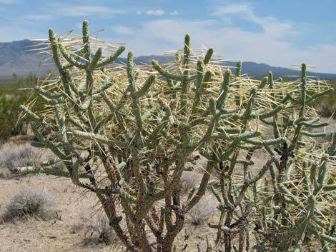
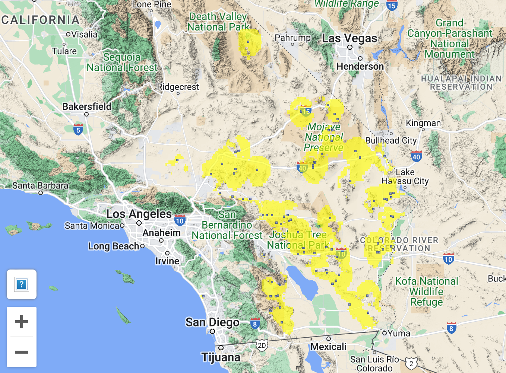

```{r setup, include=FALSE}
knitr::opts_chunk$set(echo = TRUE, message = FALSE, warning = FALSE)
```

<br>  

 

## The importance of Cylindropuntia ramosissima to animal species ecologically.


### Questions
1. Does [Pencil cholla](https://calscape.org/Cylindropuntia-ramosissima-()) potentially support other species such as moths locally within Mojave?  
2. Does the height of individual cacti or extent of branching influence visitation rates?  
3. Does the size of a cacti correlate with its extent of flowering?  

4. Where are there the most flowering?
5. Does the spatial co-occurrences of p. cholla relate to individual cacti size, flowering rates, or visitation rates?  OR does it size/shape matter to flowering even.  Basically, do a floral survey.  


### Experiment a. A cam trap survey of visiting rates to Pencil cholla and the importance of its morphology  

**Purpose**  
Qs 1 & 2 (and to a lesser extent pilot Q3)

**Methods**   
Select p. cholla that vary in size and branching but are flowering to some extent. Measure size and n branches.
Cam trap a set of individuals, cams facing sets of branches with flowers.


Key measures: x: size of cacti, n branches, n flowers; y: visitation rate, n flowers reused. 


Work at MNP only. 
IF flowers open only one night, harvest fruit at end?  

**Df**  
Datasheet.  

```{r}
library(tidyverse)
dfa <- read_csv("data/expta.csv")
knitr::kable(dfa)

```

**Metadata**  

```{r}
library(tidyverse)
dfa_meta <- read_csv("data/expta_metadata.csv")
knitr::kable(dfa_meta)

```


### Experiment b. A local or regional survey of size, shape, and flowering rates of Pencil cholla in the Mojave and region.  





**Purpose**  
Qs 4 & maybe 5 a bit.    

**Methods**   
Everywhere you zip around, measure height, n_branches, and n_flowers for perhaps 5-7 sites within the region. 
Measure density of P. cholla too - at each site - like the density survey - any method for control for area sampled, ie run out a 10 m x 10 m set of tapes, count total n P. cholla, then measure a small one, medium one, and big one for key morpho measures.  

